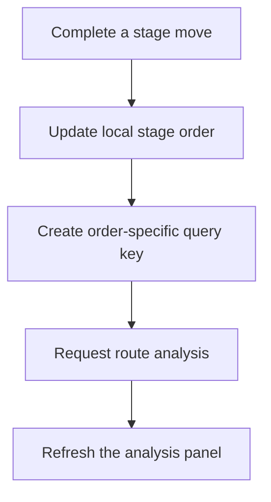
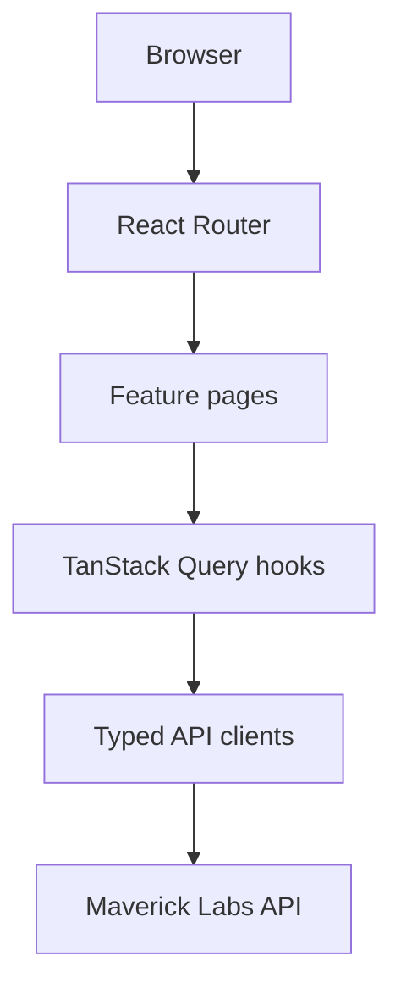

# Maverick Labs Frontend

[](https://github.com/Danyaell/maverick-labs-fe/actions/workflows/ci.yml)

> A responsive React application for exploring Mega Man X game data, comparing stages, building accessible boss routes, and seeing difficulty, backtracking, time, and recommendations update live.


Maverick Labs turns the data and analysis exposed by the companion backend into an interactive route-planning experience:

- Explore the eight main Mega Man X games in a visual catalog.
- Inspect each modeled stage, Maverick, weapon reward, and collectible.
- Reorder the eight MMX stages with pointer, touch, keyboard, or arrow controls.
- See route analysis refresh automatically after every completed move.
- Compare difficulty, backtracking, estimated time, warnings, recommendations, and score breakdowns.

This repository contains the React frontend. The companion Java/Spring Boot API is available at [maverick-labs-be](https://github.com/Danyaell/maverick-labs-be).

## Table of contents

- [Project status](#project-status)
- [Features](#features)
- [How Live Route Analysis works](#how-live-route-analysis-works)
- [Accessibility and responsive behavior](#accessibility-and-responsive-behavior)
- [Tech stack](#tech-stack)
- [Architecture](#architecture)
- [Application routes](#application-routes)
- [Getting started](#getting-started)
- [Configuration](#configuration)
- [Backend integration](#backend-integration)
- [Data fetching and client state](#data-fetching-and-client-state)
- [Testing](#testing)
- [Project structure](#project-structure)
- [Production build and deployment](#production-build-and-deployment)
- [Current limitations](#current-limitations)
- [Roadmap](#roadmap)
- [Contributing](#contributing)
- [License and disclaimer](#license-and-disclaimer)

## Project status

Maverick Labs is under active development. The current frontend provides a complete catalog-to-analysis vertical slice for the original **Mega Man X**.

| Area | Current coverage |
|---|---|
| Games represented in the catalog | 8 (`MMX` through `MMX8`) |
| Games with an enabled detail experience | 1 (`MMX`) |
| Modeled MMX Maverick stages | 8 |
| Route goal | `HUNDRED_PERCENT` |
| Route input methods | Pointer, touch, keyboard drag, and arrow buttons |
| Analysis modes | Summary, recommendations, and breakdown |
| Responsive coverage | Mobile layouts from 320 px through desktop |

`MMX2` through `MMX8` are displayed as coming-soon entries. Their catalog metadata and title assets are available, but their detail and route-planning experiences are intentionally disabled until the backend models their stages.

## Features

### Game catalog

- Loads the catalog from the backend and displays games in release order.
- Uses local title assets resolved from backend-provided asset keys.
- Clearly distinguishes the available MMX experience from coming-soon games.
- Includes loading, empty, error, and not-found states.

### Game detail

- Recreates the MMX stage-select layout with an interactive selected stage.
- Shows the stage name, Maverick, boss artwork, and weapon reward.
- Lists collectibles and upgrades available in the selected stage.
- Provides a direct path from stage exploration to the Route Builder.

### Accessible Route Builder

- Initializes the route using the backend stage order.
- Reorders stages through a dedicated drag handle.
- Supports pointer and touch input with different activation constraints.
- Preserves native arrow buttons as a visible and keyboard-accessible alternative.
- Disables movement controls correctly at list boundaries.
- Keeps numbering and rendered card order synchronized after every move.
- Resets the route to its default order.

### Live Route Analysis

- Starts automatically when the Route Builder loads.
- Refreshes only after a completed reorder operation.
- Keeps the previous analysis visible while the next order is being evaluated.
- Shows explicit analyzing, updating, up-to-date, and unavailable states.
- Supports manual retry after an analysis error.
- Presents three accessible tabs:
  - **Summary**: difficulty, backtracking, estimated time, and highest-impact change.
  - **Recommendations**: prioritized boss-order, backtracking, and route-efficiency guidance.
  - **Breakdown**: score contributions and route warnings.
- Removes recommendations whose normalized message duplicates a warning.
- Limits the currently rendered recommendation list to eight entries.

### Shared application experience

- Centralized browser routing and breadcrumbs.
- Responsive app shell with header, content area, and footer.
- Reusable design tokens for color, typography, spacing, focus, and status states.
- Local game assets bundled by Vite through `import.meta.glob`.
- Shared HTTP, loading, error, and not-found infrastructure.

## How Live Route Analysis works



The Route Builder owns only the current `gameCode` and ordered stage slugs. TanStack Query treats each game, goal, and stage permutation as a separate cached query:

```text
["route-analysis", gameCode, goal, stageOrder]
```

While a new order is being analyzed, `keepPreviousData` preserves the last successful response and the UI displays an updating state. Requests receive an `AbortSignal`, allowing obsolete work to be cancelled. Since an analysis is deterministic for the same order, successful entries remain fresh for their cache lifetime.

## Accessibility and responsive behavior

The route-ordering experience is designed so drag and drop is never the only available interaction.

- Drag handles are semantic buttons with position-aware accessible names.
- Arrow buttons provide explicit move-up and move-down actions.
- The default dnd-kit keyboard sensor supports keyboard-driven sorting.
- Touch dragging uses a 250 ms delay with 5 px tolerance to reduce accidental activation while scrolling.
- Focus-visible styles are provided for handles, controls, tabs, and actions.
- Tabs implement `role="tablist"`, `role="tab"`, `role="tabpanel"`, `aria-selected`, and roving `tabIndex`.
- Tab navigation supports `ArrowLeft`, `ArrowRight`, `Home`, and `End`.
- Live analysis status uses `role="status"`, `aria-live="polite"`, and `aria-busy`.
- Loading and error states expose accessible labels and alerts.
- Motion-heavy feedback and skeleton animations are disabled when `prefers-reduced-motion` is enabled.
- Mobile, tablet, and desktop layouts adapt the stage list and analysis panel without requiring horizontal page scrolling.

## Tech stack

| Area | Technology |
|---|---|
| UI library | React 19.2 |
| Language | TypeScript 6.0 in strict mode |
| Build tool | Vite 8.1 |
| Routing | React Router 8.1 |
| Server-state management | TanStack Query 5 |
| Drag and drop | dnd-kit React and DOM 0.5 |
| Styling | CSS Modules and shared CSS design tokens |
| Unit and integration tests | Vitest 1.3 with jsdom |
| Component testing | Testing Library and user-event |
| Static analysis | ESLint 10 with type-aware typescript-eslint rules |
| CI | GitHub Actions on Node.js 24 |
| Deployment configuration | Vercel SPA rewrite |

## Architecture

The frontend is organized by feature and keeps routing, data fetching, domain types, and presentation responsibilities separate.



- **App layer** owns the shell, route tree, breadcrumbs, Query Client, and shared page boundaries.
- **Feature pages** coordinate route parameters, queries, local selection state, and loading/error rendering.
- **Feature components** render catalog, game detail, route ordering, and analysis views.
- **Query hooks** define cache keys, freshness, cancellation, and placeholder behavior.
- **API clients** build HTTP requests and validate important response payloads.
- **Shared infrastructure** provides fetch handling, environment configuration, and reusable UI states.
- **Utilities** map backend asset keys to Vite-bundled local images.

## Application routes

| Route | Purpose |
|---|---|
| `/` | Redirects to the game catalog |
| `/games` | Displays all catalog entries |
| `/games/:gameCode` | Displays game and stage details |
| `/games/:gameCode/route-builder` | Builds and analyzes a route |
| `*` | Displays the not-found page |

Breadcrumb metadata is defined alongside the route configuration so nested pages retain a consistent navigation trail.

## Getting started

### Prerequisites

- Git
- Node.js 24 and npm, matching the CI environment
- A running [Maverick Labs backend](https://github.com/Danyaell/maverick-labs-be)

### 1. Clone the repository

```bash
git clone https://github.com/Danyaell/maverick-labs-fe.git
cd maverick-labs-fe
```

### 2. Install dependencies

Use `npm ci` when reproducing the lockfile exactly or running CI-like verification:

```bash
npm ci
```

Use `npm install` when intentionally updating dependencies:

```bash
npm install
```

### 3. Configure the backend URL

Create a `.env.local` file in the repository root:

```dotenv
VITE_API_BASE_URL=http://localhost:8080
```

Do not include a trailing slash. The application removes one defensively, but a normalized base URL keeps local and hosted configuration consistent.

### 4. Start the backend

Run the companion API on `http://localhost:8080`. Its CORS configuration must allow the Vite origin, which is normally `http://localhost:5173`.

### 5. Start the frontend

```bash
npm run dev
```

Open the local URL shown by Vite, normally:

```text
http://localhost:5173
```

### 6. Verify the vertical slice

1. Open `/games` and select Mega Man X.
2. Select different stages and inspect their details.
3. Choose **Build Route**.
4. Move a stage using drag and drop or the arrow controls.
5. Confirm that Live Route Analysis changes from updating to up to date.

## Configuration

| Variable | Required | Example | Purpose |
|---|:---:|---|---|
| `VITE_API_BASE_URL` | Yes | `http://localhost:8080` | Base URL of the Maverick Labs backend |

Vite exposes only variables prefixed with `VITE_` to client code. Do not place credentials or secrets in frontend environment variables because they are included in the browser bundle.

The application fails fast during startup when `VITE_API_BASE_URL` is missing.

## Backend integration

The frontend consumes three API operations:

| Method | Endpoint | Frontend use |
|---|---|---|
| `GET` | `/api/v1/games` | Load and sort the game catalog |
| `GET` | `/api/v1/games/{gameCode}` | Load stages, bosses, weapons, and collectibles |
| `POST` | `/api/v1/routes/analyze` | Analyze the current stage order |

The live route request has this shape:

```json
{
  "gameCode": "MMX",
  "stageOrder": [
    "chill-penguin",
    "storm-eagle",
    "flame-mammoth",
    "spark-mandrill",
    "armored-armadillo",
    "launch-octopus",
    "boomer-kuwanger",
    "sting-chameleon"
  ],
  "goal": "HUNDRED_PERCENT"
}
```

The response includes:

- overall difficulty score and label;
- backtracking score;
- estimated route duration;
- route warnings;
- recommendations with severity and related stages;
- base difficulty, combat difficulty, weakness reduction, time penalty, and route-efficiency breakdown values.

The shared HTTP client throws on non-success responses. The catalog and route-analysis clients also validate important response shapes before the data reaches the UI.

## Data fetching and client state

TanStack Query manages backend state while React local state manages UI selections and route order.

| Query | Key | Freshness behavior |
|---|---|---|
| Game catalog | `["games", "list"]` | Fresh for 5 minutes |
| Game detail | `["games", "detail", gameCode]` | Fresh for 5 minutes |
| Route analysis | `["route-analysis", gameCode, goal, stageOrder]` | Deterministic result remains fresh; unused cache is collected after 15 minutes |

Additional behavior:

- Queries receive TanStack Query's `AbortSignal`.
- Application queries retry once by default.
- Route analysis is disabled until a game code and non-empty order exist.
- Previous analysis remains visible during an order change.
- Returning to a recently analyzed order can reuse its cached result.
- The custom route order is local UI state and is not persisted to the backend.

## Testing

The test environment uses jsdom and loads global test setup from `src/test/setup.ts`.

### Test coverage areas

- Game cards and game-detail interaction.
- API request shape and route-analysis response validation.
- Initial stage ordering and pure reorder utilities.
- Accessible movement controls, boundary states, and reset behavior.
- Automatic initial analysis and order-specific reanalysis.
- Preservation of previous analysis while updating.
- Loading, error, retry, and successful recovery states.
- Recommendation deduplication and list limits.
- Mouse-independent tab selection and keyboard navigation.
- Test-specific TanStack Query clients with retries disabled.
- Browser API mocks such as `ResizeObserver` for dnd-kit under jsdom.

### Run tests

Interactive/watch mode:

```bash
npm test
```

Single run, matching CI:

```bash
npm run test:run
```

Explicit watch command:

```bash
npm run test:watch
```

### Lint and build verification

```bash
npm run lint
npm run build
```

GitHub Actions executes dependency installation, type-aware linting, tests, and the production build for pull requests targeting `main` and pushes to `main`.

## Project structure

```text
src/
    app/
        pages/                       # Shared route-level pages
        App.tsx                      # Application shell
        queryClient.ts               # Production TanStack Query client
        router.tsx                   # Route tree and breadcrumbs
    assets/
        games/                       # Game logos, stages, bosses, weapons and collectibles
    features/
        games/
            api/                     # Catalog and detail API clients
            components/              # Game, stage, boss, weapon and collectible UI
            hooks/                   # Catalog and game-detail queries
            pages/                   # Catalog and detail pages
            types/                   # Game domain contracts
        route-builder/
            api/                     # Route-analysis API client and validation
            components/              # Sortable cards and analysis presentation
            hooks/                   # Route state and analysis queries
            pages/                   # Route Builder page
            types/                   # Route request and response contracts
            utils/                   # Initial order, reordering and mapping utilities
    shared/
        api/                          # Shared HTTP client
        components/                   # Breadcrumbs, loading and error states
        config/                       # Environment configuration
    styles/                           # Global styles and design tokens
    test/
        fixtures/                     # Shared typed test data
        renderWithQueryClient.tsx     # Query-aware render helper
        setup.ts                      # jest-dom and browser API mocks
    utils/
        assets.ts                     # Backend asset-key resolver
    main.tsx                          # React entry point
```

Root configuration:

```text
.github/workflows/ci.yml              # Lint, test and build CI
eslint.config.js                      # Type-aware ESLint flat config
vercel.json                           # SPA route rewrite
vite.config.ts                        # Vite application config
vitest.config.ts                      # jsdom test config
tsconfig*.json                        # Strict TypeScript project configs
```

## Production build and deployment

### Create a production build

```bash
npm run build
```

The command runs the TypeScript project build and then generates the optimized Vite bundle in `dist/`.

Preview the bundle locally:

```bash
npm run preview
```

### Deploy to Vercel

The included `vercel.json` rewrites application paths to `/`, allowing React Router routes to load directly or survive a browser refresh.

1. Import the repository into Vercel.
2. Select the Vite framework preset.
3. Configure `VITE_API_BASE_URL` with the deployed backend URL.
4. Use `npm run build` as the build command and `dist` as the output directory.
5. Allow the deployed frontend origin in the backend CORS configuration.

The same environment-variable and SPA-rewrite requirements apply to other static hosting platforms.

## Current limitations

- Only `MMX` has an enabled detail and route-planning experience.
- `HUNDRED_PERCENT` is the only supported route goal.
- A full route currently requires all eight modeled Maverick stages.
- Route order is stored only in memory and resets after a page reload.
- Routes cannot yet be saved, named, shared, or compared side by side.
- Recommendation messages are deduplicated by normalized text and capped at eight visible entries; grouping and expansion are not implemented yet.
- Breakdown values do not yet communicate positive and negative impact through semantic color or explanatory copy.
- The frontend depends on a reachable backend and does not provide an offline dataset.
- The automated suite does not yet include real-browser end-to-end coverage for physical pointer and touch drag gestures.
- Sigma fortress stages and speedrun-specific planning are outside the current route-building scope.

## Roadmap

- Enable detailed experiences for `MMX2` through `MMX8` as backend data becomes available.
- Group related recommendations and add an explicit **Show all** interaction.
- Improve the visual meaning and explanation of analysis and breakdown values.
- Add additional route goals and partial-route analysis.
- Persist or share custom routes.
- Add route comparison and richer recommendation prioritization.
- Add real-browser end-to-end tests for pointer, touch, and keyboard drag flows.
- Publish production frontend and backend environments with documented URLs.

## Contributing

Contributions and review suggestions are welcome.

1. Create a focused branch from `main`.
2. Keep feature code inside `src/features/<feature-name>/`.
3. Place server-state behavior in TanStack Query hooks and HTTP behavior in API clients.
4. Preserve a non-drag alternative for every ordering action.
5. Add or update tests for behavioral changes.
6. Run the same quality gates as CI:

```bash
npm ci
npm run lint
npm run test:run
npm run build
```

7. Open a pull request targeting `main` with a focused summary and verification notes.

## License and disclaimer

Maverick Labs is a fan-made, educational, non-commercial portfolio project. Mega Man, Mega Man X, character names, artwork, and related properties belong to Capcom and their respective rights holders. This project is not affiliated with or endorsed by Capcom.

## Author

Created by [Danyaell Martínez Ortiz](https://github.com/Danyaell).
