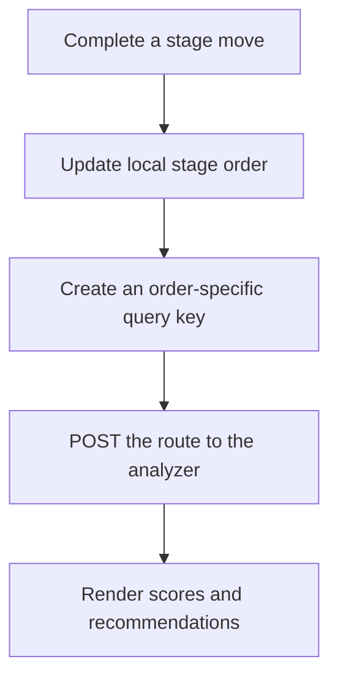
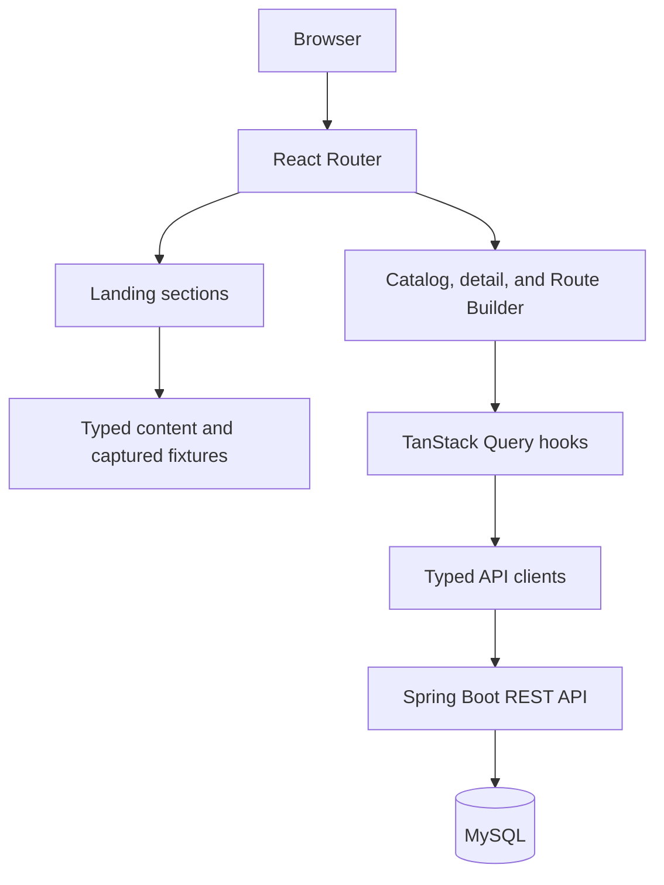

# Maverick Labs Frontend

[](https://github.com/Danyaell/maverick-labs-fe/actions/workflows/ci.yml)

> Plan smarter Mega Man X routes and see how boss weaknesses, collectible requirements, stage order, and progression rules affect difficulty, backtracking, estimated time, warnings, and recommendations.

[Live application](https://mavericklabs.vercel.app/) · [Swagger UI](https://maverick-labs-be-production.up.railway.app/swagger-ui.html) · [Backend repository](https://github.com/Danyaell/maverick-labs-be) · [Project roadmap](https://github.com/users/Danyaell/projects/2)


Maverick Labs turns the catalog and route analysis exposed by the companion backend into an accessible, responsive strategy tool:

- Explore the eight main Mega Man X titles in release order.
- Inspect the modeled stages, Mavericks, weapon rewards, and collectibles for Mega Man X.
- Reorder all eight MMX Maverick stages with pointer, touch, keyboard drag, or arrow controls.
- Analyze difficulty, backtracking, estimated time, warnings, recommendations, and score breakdowns.
- Learn how the rule-based analyzer works through a layered product landing page.
- Inspect the public REST contract and continue into the deployed Swagger UI.

The catalog includes `MMX` through `MMX8`, but **Mega Man X is currently the only game with enabled detail and route-planning experiences**. `MMX2` through `MMX8` remain catalog-only coming-soon entries.

## Table of contents

- [Project status](#project-status)
- [Features](#features)
- [How live route analysis works](#how-live-route-analysis-works)
- [Public API and backend integration](#public-api-and-backend-integration)
- [Accessibility and responsive behavior](#accessibility-and-responsive-behavior)
- [Tech stack](#tech-stack)
- [Architecture](#architecture)
- [Application routes](#application-routes)
- [Getting started](#getting-started)
- [Configuration](#configuration)
- [Data fetching and client state](#data-fetching-and-client-state)
- [Testing](#testing)
- [Project structure](#project-structure)
- [Production build and deployment](#production-build-and-deployment)
- [Current limitations](#current-limitations)
- [Roadmap](#roadmap)
- [Contributing](#contributing)
- [License and disclaimer](#license-and-disclaimer)

## Project status

Maverick Labs is deployed and under active development. The current release provides a complete catalog-to-analysis vertical slice for the original **Mega Man X**.

| Area | Current coverage |
|---|---|
| Live frontend | Deployed on Vercel |
| Companion API | Deployed on Railway |
| Public API documentation | Swagger UI and OpenAPI JSON |
| Games represented in the catalog | 8 (`MMX` through `MMX8`) |
| Games with enabled detail and route planning | 1 (`MMX`) |
| Modeled MMX Maverick stages | 8 |
| Route goal | `HUNDRED_PERCENT` |
| Route input methods | Pointer, touch, keyboard drag, and arrow buttons |
| Analysis presentation | Summary, recommendations, and breakdown |
| Landing-page coverage | Hero, capabilities, captured demo, engine, API, architecture, and roadmap |
| Responsive baseline | Layouts from 320 px through desktop |

`MMX2` through `MMX8` include catalog metadata and title assets, but their detail and route-planning routes are intentionally unavailable until the backend models their stages, bosses, weapons, collectibles, and requirements.

## Features

### Product landing page

The root route presents the product before handing visitors off to the catalog or Route Builder.

- A focused route-planning value proposition with direct actions for the MMX Route Builder, API showcase, and game catalog.
- A four-step capability overview from catalog exploration to route analysis.
- A deterministic before-and-after MMX route comparison based on captured backend responses.
- A five-stage explanation of request validation, data loading, progression simulation, scoring, warnings, and recommendations.
- A compact showcase of all three public API operations with a typed request and trimmed response example.
- A runtime architecture view that separates the request path from testing, CI, and deployment concerns.
- A typed current-coverage and product-roadmap section with explicit available, next, later, and coming-soon labels.
- Stable anchors for `#capabilities`, `#demo`, `#engine`, `#api`, `#architecture`, and `#roadmap`.

The landing comparison does not call the analyzer while switching states. It renders documented, captured responses so the example remains available when the backend is temporarily unavailable. The real Route Builder continues to use live analysis.

### Game catalog

- Loads the eight-game catalog from the backend and displays entries in release order.
- Uses local title assets resolved from backend-provided asset keys.
- Clearly distinguishes the enabled MMX experience from coming-soon games.
- Includes loading, empty, error, and not-found states.

### Game detail

- Recreates the MMX stage-select layout with an interactive selected stage.
- Shows the stage name, Maverick, boss artwork, and weapon reward.
- Lists collectibles and upgrades available in the selected stage.
- Provides a direct path from stage exploration to the Route Builder.

### Accessible Route Builder

- Initializes the route using the backend stage order.
- Reorders stages through dedicated drag handles.
- Supports pointer and touch input with separate activation constraints.
- Preserves arrow buttons as a visible, keyboard-accessible alternative to drag and drop.
- Disables movement controls at list boundaries.
- Keeps numbering and rendered card order synchronized after every move.
- Resets the route to its default order.

### Live Route Analysis

- Starts automatically when the Route Builder loads.
- Refreshes after each completed reorder operation.
- Keeps the previous successful result visible while the new order is evaluated.
- Shows explicit analyzing, updating, up-to-date, unavailable, and retry states.
- Presents three accessible views:
  - **Summary:** difficulty, backtracking, estimated time, and the highest-impact change.
  - **Recommendations:** prioritized boss-order, backtracking, and route-efficiency guidance.
  - **Breakdown:** score contributions and route warnings.
- Removes recommendations whose normalized message duplicates a warning.
- Limits the rendered recommendation list to eight entries.

### Shared application experience

- Centralized browser routing and breadcrumb metadata.
- Responsive application shell with header, content area, and footer.
- Shared design tokens for color, typography, spacing, focus, status, and surfaces.
- Local game assets bundled by Vite through `import.meta.glob`.
- Shared HTTP, loading, error, and not-found infrastructure.

## How live route analysis works



The Route Builder owns the current `gameCode` and ordered stage slugs. TanStack Query treats every game, goal, and stage permutation as a separate deterministic query:

```text
["route-analysis", gameCode, goal, stageOrder]
```

The frontend sends the `HUNDRED_PERCENT` goal and all eight stage slugs. The backend then:

1. validates the game and stage order;
2. loads stage, boss, weapon, collectible, and requirement data;
3. simulates progression in route order;
4. makes each weapon available only after its provider stage is cleared;
5. applies boss-weakness reductions only when the required weapon is already available;
6. detects collectible requirements that create revisit pressure;
7. calculates difficulty, backtracking, estimated time, and breakdown values;
8. returns warnings and prioritized rule-based recommendations.

While a new order is being analyzed, `keepPreviousData` preserves the last successful response and the UI displays an updating state. Requests receive an `AbortSignal`, allowing obsolete work to be cancelled. Successful route-analysis results remain fresh for their cache lifetime because the same input produces the same analysis.

Estimated time is a model output derived from route rules and penalties. It is not a speedrun prediction or a guaranteed completion time.

## Public API and backend integration

The frontend consumes three public operations:

| Method | Endpoint | Frontend use |
|---|---|---|
| `GET` | `/api/v1/games` | Load and sort the eight-game catalog |
| `GET` | `/api/v1/games/{gameCode}` | Load modeled stages, bosses, weapons, and collectibles |
| `POST` | `/api/v1/routes/analyze` | Analyze an ordered route and return model outputs |

Production documentation:

- [Swagger UI](https://maverick-labs-be-production.up.railway.app/swagger-ui.html)
- [OpenAPI JSON](https://maverick-labs-be-production.up.railway.app/v3/api-docs)
- [Backend source](https://github.com/Danyaell/maverick-labs-be)

The live request currently has this shape:

```json
{
  "gameCode": "MMX",
  "stageOrder": [
    "chill-penguin",
    "spark-mandrill",
    "storm-eagle",
    "flame-mammoth",
    "armored-armadillo",
    "launch-octopus",
    "boomer-kuwanger",
    "sting-chameleon"
  ],
  "goal": "HUNDRED_PERCENT"
}
```

The response includes:

- overall difficulty score and label;
- backtracking score;
- modeled estimated duration;
- route warnings;
- recommendations with type, severity, message, and related stages;
- base difficulty, combat difficulty, weakness reduction, route efficiency, and time-penalty breakdown values.

The shared HTTP client throws on non-success responses. The catalog and route-analysis clients also validate important response shapes before data reaches the UI.

## Accessibility and responsive behavior

The product is designed so drag and drop, color, animation, and pointer input are never the only ways to understand or operate important functionality.

- Drag handles are semantic buttons with position-aware accessible names.
- Arrow buttons provide explicit move-up and move-down actions.
- The dnd-kit keyboard sensor supports keyboard-driven sorting.
- Touch dragging uses a delay and movement tolerance to reduce accidental activation while scrolling.
- Focus-visible styles are provided for handles, controls, tabs, links, and actions.
- Analysis tabs use `tablist`, `tab`, and `tabpanel` semantics with roving `tabIndex`.
- Tab navigation supports `ArrowLeft`, `ArrowRight`, `Home`, and `End`.
- Analysis status uses `role="status"`, `aria-live="polite"`, and `aria-busy`.
- The landing comparison uses native buttons, `aria-pressed`, and a polite live-region announcement.
- Engine details use native `details` and `summary` disclosure controls.
- API code blocks have accessible captions and can receive focus for horizontal keyboard scrolling.
- Architecture and roadmap visuals retain ordered-list and list semantics and use visible text labels in addition to color.
- Loading and error states expose accessible names or alerts.
- Motion-heavy feedback and skeleton animations are disabled when `prefers-reduced-motion` is enabled.
- Mobile, tablet, and desktop layouts avoid horizontal page overflow from the 320 px baseline upward.

## Tech stack

| Area | Technology |
|---|---|
| UI library | React 19.2 |
| Language | TypeScript 6.0 in strict mode |
| Build tool | Vite 8.1 |
| Routing | React Router 8.1 |
| Server-state management | TanStack Query 5 |
| Drag and drop | dnd-kit React and DOM 0.5 |
| Styling | CSS Modules and shared CSS design tokens |
| Unit and integration tests | Vitest 1.3 with jsdom |
| Component testing | Testing Library and user-event |
| Static analysis | ESLint 10 with type-aware typescript-eslint rules |
| CI | GitHub Actions on Node.js 24 |
| Frontend hosting | Vercel |
| Backend hosting | Railway |

## Architecture

The frontend is organized by feature and separates static product storytelling, server-state queries, HTTP integration, and interactive route state.



- **App layer** owns the shell, route tree, breadcrumbs, Query Client, and shared page boundaries.
- **Landing feature** owns static typed content, captured analyzer fixtures, local comparison state, and links to deeper documentation.
- **Feature pages** coordinate route parameters, server queries, local selection state, and loading/error rendering.
- **Feature components** render the catalog, game detail, route ordering, analysis panel, and landing sections.
- **Query hooks** define cache keys, freshness, cancellation, and placeholder behavior.
- **API clients** build HTTP requests and validate important response payloads.
- **Shared infrastructure** provides fetch handling, environment configuration, stable external links, and reusable UI states.
- **Utilities** map backend asset keys to Vite-bundled local images.

The production runtime request path is:

```text
Browser -> React/TypeScript client -> Spring Boot REST API -> MySQL
```

GitHub Actions, Testcontainers, Vitest, Vercel, and Railway are testing, delivery, or hosting concerns rather than additional hops in that browser request path.

## Application routes

| Route | Purpose |
|---|---|
| `/` | Product landing page |
| `/games` | Displays all eight catalog entries |
| `/games/:gameCode` | Displays game and stage details; currently enabled for `MMX` |
| `/games/:gameCode/route-builder` | Builds and analyzes a route; currently enabled for `MMX` |
| `*` | Displays the not-found page |

Breadcrumb metadata is defined alongside the route configuration so nested product pages retain a consistent navigation trail. The root landing page intentionally renders without a breadcrumb.

## Getting started

### Prerequisites

- Git
- Node.js 24 and npm, matching the CI environment
- A running [Maverick Labs backend](https://github.com/Danyaell/maverick-labs-be) for catalog, detail, and live route analysis

The product landing page and its captured comparison can render without a running backend, but the live product flows require the API.

### 1. Clone the repository

```bash
git clone https://github.com/Danyaell/maverick-labs-fe.git
cd maverick-labs-fe
```

### 2. Install dependencies

Use `npm ci` to reproduce the lockfile exactly:

```bash
npm ci
```

Use `npm install` only when intentionally updating dependencies.

### 3. Configure local environment variables

Create `.env.local` in the repository root:

```dotenv
VITE_API_BASE_URL=http://localhost:8080
VITE_API_DOCS_URL=http://localhost:8080/swagger-ui.html
```

`VITE_API_DOCS_URL` is optional. When omitted, the landing page links to the deployed production Swagger UI.

### 4. Start the backend

Run the companion API on `http://localhost:8080`. Its CORS configuration must allow the Vite development origin, normally `http://localhost:5173`.

### 5. Start the frontend

```bash
npm run dev
```

Open the URL printed by Vite, normally `http://localhost:5173`.

### 6. Verify the product flow

1. Open `/` and inspect the landing-page sections.
2. Follow the primary action into the MMX Route Builder.
3. Return to `/games` and select Mega Man X.
4. Select different stages and inspect their details.
5. Move a stage using drag and drop or the arrow controls.
6. Confirm that live analysis changes from updating to up to date.
7. Open the API section and verify the Swagger UI link.

## Configuration

| Variable | Required | Default/example | Purpose |
|---|:---:|---|---|
| `VITE_API_BASE_URL` | Yes | `http://localhost:8080` | Base URL used by the typed API clients |
| `VITE_API_DOCS_URL` | No | Deployed production Swagger UI | Overrides the documentation action in the landing page |

The application removes one trailing slash from configured URLs. `VITE_API_BASE_URL` is validated during startup and the application fails fast when it is missing.

Vite exposes variables prefixed with `VITE_` to browser code. Never place credentials or secrets in frontend environment variables.

Stable repository and GitHub Project links are centralized in `src/shared/config/env.ts`; they are not environment-specific secrets.

## Data fetching and client state

TanStack Query manages backend state while React local state manages UI selections, route order, disclosure controls, and the landing comparison.

| Query | Key | Freshness behavior |
|---|---|---|
| Game catalog | `["games", "list"]` | Fresh for 5 minutes |
| Game detail | `["games", "detail", gameCode]` | Fresh for 5 minutes |
| Route analysis | `["route-analysis", gameCode, goal, stageOrder]` | Fresh indefinitely; unused cache collected after 15 minutes |

Additional behavior:

- Queries receive TanStack Query's `AbortSignal`.
- Application queries retry once by default.
- Game detail is disabled until a non-empty game code is available.
- Route analysis is disabled until a game code and non-empty order are available.
- Previous analysis remains visible during an order change.
- Returning to a recently analyzed order can reuse its cached deterministic result.
- Custom route order is local state and is not persisted after a reload.
- Landing copy and architecture/roadmap content come from typed static data.
- The landing before-and-after comparison uses captured response fixtures and issues no requests while toggling.

## Testing

The test environment uses jsdom and loads shared setup from `src/test/setup.ts`.

### Coverage areas

- Root routing, nested product routes, breadcrumbs, and not-found behavior.
- Landing anchors and cross-route hash scrolling.
- Hero calls to action and catalog discoverability.
- Typed capability content and links.
- Captured route-demo fixture integrity, state switching, metric changes, keyboard operation, and Route Builder action.
- Engine stages, disclosure controls, technical copy, and backend link.
- API endpoint labels, request/response examples, Swagger UI link, and backend repository link.
- Runtime architecture labels, stack groups, and repository links.
- Current coverage, roadmap phases, coming-soon labels, and GitHub Project link.
- Game cards and game-detail interaction.
- API request shape and route-analysis response validation.
- Initial stage ordering and pure reorder utilities.
- Pointer-independent movement controls, boundary states, and reset behavior.
- Automatic initial analysis and order-specific reanalysis.
- Preservation of previous analysis while updating.
- Loading, error, retry, and successful recovery states.
- Recommendation deduplication and list limits.
- Mouse-independent tab selection and keyboard navigation.
- Test-specific TanStack Query clients with retries disabled.
- Browser API mocks such as `ResizeObserver` for dnd-kit under jsdom.

### Commands

Interactive/watch mode:

```bash
npm test
```

Single run, matching CI:

```bash
npm run test:run
```

Coverage report:

```bash
npm run test:coverage
```

Lint and production build:

```bash
npm run lint
npm run build
```

GitHub Actions runs `npm ci`, type-aware linting, the complete test suite, and the production build for pull requests targeting `main` and pushes to `main`.

## Project structure

```text
src/
    app/
        pages/                       # Shared route-level pages
        App.tsx                      # Application shell
        queryClient.ts               # Production TanStack Query client
        router.tsx                   # Route tree and breadcrumbs
    assets/
        games/                       # Game logos, stages, bosses, weapons, and collectibles
    features/
        games/
            api/                     # Catalog and detail API clients
            components/              # Game, stage, boss, weapon, and collectible UI
            hooks/                   # Catalog and game-detail queries
            pages/                   # Catalog and detail pages
            types/                   # Game domain contracts
        landing/
            components/              # Hero, demo, engine, API, architecture, and roadmap
            data/                    # Typed copy and captured analyzer fixtures
            pages/                   # Landing-page composition and hash scrolling
        route-builder/
            api/                     # Route-analysis API client and validation
            components/              # Sortable cards and analysis presentation
            hooks/                   # Route state and analysis queries
            pages/                   # Route Builder page
            types/                   # Route request and response contracts
            utils/                   # Initial order, reordering, and mapping utilities
    shared/
        api/                          # Shared HTTP client
        components/                   # Breadcrumbs, loading, and error states
        config/                       # Environment configuration and stable links
    styles/                           # Global styles and design tokens
    test/
        fixtures/                     # Shared typed test data
        renderWithQueryClient.tsx     # Query-aware render helper
        setup.ts                      # jest-dom and browser API mocks
    utils/
        assets.ts                     # Backend asset-key resolver
    main.tsx                          # React entry point
```

Root configuration:

```text
.github/workflows/ci.yml              # Lint, test, and build CI
.env.example                          # Local environment-variable template
eslint.config.js                      # Type-aware ESLint flat config
vercel.json                           # SPA route rewrite
vite.config.ts                        # Vite application config
vitest.config.ts                      # jsdom test configuration
tsconfig*.json                        # Strict TypeScript project configs
```

## Production build and deployment

### Production services

- Frontend: [mavericklabs.vercel.app](https://mavericklabs.vercel.app/)
- API documentation: [Swagger UI](https://maverick-labs-be-production.up.railway.app/swagger-ui.html)
- OpenAPI contract: [OpenAPI JSON](https://maverick-labs-be-production.up.railway.app/v3/api-docs)

### Create a production build

```bash
npm run build
```

The command runs the TypeScript project build and generates the optimized Vite bundle in `dist/`.

Preview the production bundle locally:

```bash
npm run preview
```

### Deploy to Vercel

`vercel.json` rewrites application paths to `/`, allowing nested React Router routes and hash-linked landing sections to survive direct navigation and browser refreshes.

Required deployment settings:

1. Use the Vite framework preset.
2. Configure `VITE_API_BASE_URL` with the deployed backend base URL.
3. Optionally configure `VITE_API_DOCS_URL`; otherwise the production Swagger UI fallback is used.
4. Use `npm run build` as the build command.
5. Use `dist` as the output directory.
6. Allow the deployed frontend origin in the backend CORS configuration.

Preview deployment URLs are intentionally not embedded in product copy or documentation.

## Current limitations

- Only `MMX` has enabled detail and route-planning experiences.
- `MMX2` through `MMX8` are catalog-only coming-soon entries.
- `HUNDRED_PERCENT` is the only supported route goal.
- A full route currently requires all eight modeled Maverick stages.
- Route order is stored only in memory and resets after a page reload.
- Routes cannot yet be saved, named, shared, or compared side by side.
- Recommendation messages are normalized, deduplicated, and capped at eight visible entries; grouping and expansion are not implemented yet.
- The Route Builder breakdown does not yet fully explain the positive or negative meaning of every contribution.
- Catalog, detail, and live route analysis require a reachable backend; only the landing's captured comparison is backend-independent.
- The automated suite does not yet include real-browser end-to-end coverage for physical pointer and touch gestures.
- Sigma fortress stages, execution skill, health consumption, lives, and speedrun-specific techniques are outside the current model.

## Roadmap

The roadmap communicates direction rather than committed dates or percentages. Current progress is tracked in the [Maverick Labs GitHub Project](https://github.com/users/Danyaell/projects/2).

### Next

- Group related recommendations and add an explicit **Show all** interaction.
- Improve score-contribution, breakdown, and recommendation explanations.
- Add detailed stages, bosses, weapons, collectibles, and requirements for additional games as backend modeling becomes available.

### Later

- Support additional route goals and partial-route analysis.
- Persist, name, and share custom routes.
- Compare route configurations and analysis results side by side.
- Expand recommendation rules and prioritization.
- Add real-browser E2E coverage for pointer, touch, keyboard, and responsive flows.

## Contributing

Contributions and review suggestions are welcome.

1. Create a focused branch from `main`.
2. Keep feature code inside `src/features/<feature-name>/`.
3. Place server-state behavior in TanStack Query hooks and HTTP behavior in API clients.
4. Keep static landing content in concise typed data structures or documented fixtures.
5. Preserve a non-drag alternative for every ordering action.
6. Add or update tests for behavioral and content changes.
7. Run the same quality gates as CI:

```bash
npm ci
npm run lint
npm run test:run
npm run build
```

8. Open a pull request targeting `main` with a focused summary and verification notes.

## License and disclaimer

Maverick Labs is a fan-made, educational, non-commercial portfolio project. Mega Man, Mega Man X, character names, artwork, and related properties belong to Capcom and their respective rights holders. This project is not affiliated with or endorsed by Capcom.

## Author

Created by [Danyaell Marti­nez Ortiz](https://github.com/Danyaell).